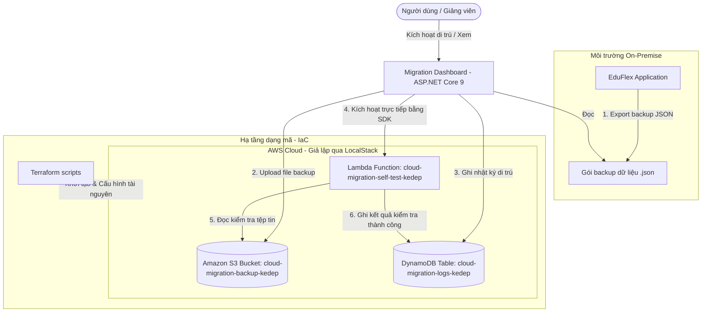

# Cloud Migration & Modernization Platform

> **Đồ án môn học Điện toán đám mây**  
> **Đề tài:** Xây dựng hệ thống mô phỏng chuyển đổi ứng dụng ASP.NET Core 9 + SQL Server từ On-premise lên Cloud bằng LocalStack và Terraform.

Hệ thống cung cấp giao diện trực quan cho phép mô phỏng quy trình di trú cơ sở dữ liệu và ứng dụng (Migration & Modernization) từ môi trường vật lý (On-premise) lên hạ tầng điện toán đám mây AWS thông qua nền tảng giả lập LocalStack và công cụ quản lý hạ tầng dạng mã (Infrastructure as Code) Terraform.

---

## 🗺️ 1. Tổng quan đề tài

Trong thực tế, việc di trú các ứng dụng truyền thống (Legacy Apps) lên môi trường Cloud thường gặp nhiều khó khăn liên quan đến việc cấu hình hạ tầng, kiểm thử kết nối và ước tính chi phí. Để khắc phục các hạn chế và giảm thiểu rủi ro, nhóm phát triển đã xây dựng **Cloud Migration & Modernization Platform** nhằm:
* Mô phỏng toàn vẹn quy trình kết xuất dữ liệu và đưa lên Cloud Storage.
* Cấu hình toàn bộ hạ tầng bằng mã nguồn (IaC - Terraform) để dễ dàng triển khai tự động hóa.
* Cung cấp bảng quản trị (Dashboard) thời gian thực theo dõi tài nguyên, ghi nhận nhật ký di trú và kiểm tra liên thông sau di trú.
* Chạy thử nghiệm rollback an toàn và cung cấp các báo cáo so sánh trước/sau chuyển đổi.

Do việc triển khai trên dịch vụ đám mây AWS thật phát sinh chi phí, đề tài này lựa chọn giải pháp **LocalStack** kết hợp **Docker** để giả lập môi trường AWS cục bộ trên máy cá nhân một cách chính xác với đầy đủ các API (S3, DynamoDB, Lambda, IAM).

---

## 🎯 2. Mục tiêu đề tài

* **Mô phỏng quy trình dịch chuyển dữ liệu (Data Migration)**: Xuất dữ liệu từ ứng dụng `EduFlex` (On-Premise) thành gói backup an toàn và tải lên hạ tầng AWS S3.
* **Tự động hóa hạ tầng (IaC)**: Viết các kịch bản Terraform để khởi tạo tự động VPC, Subnet, S3 Bucket, DynamoDB Table và Lambda Function.
* **Xây dựng Dashboard giám sát trực quan**: Phát triển ứng dụng Web bằng ASP.NET Core 9 giúp người dùng thực hiện chuyển đổi, giám sát tài nguyên thật, kiểm tra điểm sức khỏe hệ thống (Health Score) và ước tính chi phí giả lập.
* **Kiểm thử tự động hóa (Post-Migration Self-Test)**: Ứng dụng Serverless Lambda tự động chạy và đánh giá tính liên thông dữ liệu sau khi di trú thành công.
* **Khả năng khôi phục (Rollback Simulation)**: Giả lập quy trình rollback hạ tầng ghi nhận nhật ký đầy đủ mà không ảnh hưởng tới dữ liệu gốc.

---

## 🏛️ 3. Kiến trúc hệ thống

Dưới đây là sơ đồ luồng hoạt động của hệ thống mô phỏng chuyển đổi:



---

## 💻 4. Công nghệ sử dụng

| Thành phần | Công nghệ / Thư viện | Vai trò |
| :--- | :--- | :--- |
| **Hạ tầng giả lập** | Docker Desktop, LocalStack | Mô phỏng các dịch vụ AWS (S3, DynamoDB, Lambda, IAM) offline |
| **Quản lý hạ tầng** | Terraform (v1.5+) | Viết và khởi tạo tự động hóa hạ tầng (IaC) |
| **Ứng dụng Dashboard** | ASP.NET Core 9.0 MVC, C# | Web Backend, xử lý Logic di trú và tích hợp SDK kết nối Cloud |
| **Giao diện Web** | Bootstrap 5, Bootstrap Icons | CSS Framework thiết kế giao diện responsive hiện đại |
| **Vẽ biểu đồ** | Chart.js | Vẽ biểu đồ ước tính chi phí phân rã theo dịch vụ |
| **Thư viện tích hợp** | AWSSDK.S3, AWSSDK.DynamoDBv2, AWSSDK.Lambda | AWS SDK for .NET kết nối trực tiếp đến LocalStack Edge Port |
| **Định dạng dữ liệu** | Newtonsoft.Json | Serialize/Deserialize gói tin sao lưu dữ liệu và payload |
| **Môi trường chạy nhanh**| PowerShell Scripts | Tập hợp các lệnh chạy nhanh phục vụ demo |

---

## 📁 5. Cấu trúc thư mục

```text
cloud-migration-platform/
├── app/
│   ├── MigrationDashboard/           # Dự án Web Dashboard giám sát và di trú
│   │   ├── Controllers/             # Controllers điều hướng và xử lý API
│   │   ├── Models/                  # ViewModels hiển thị dữ liệu
│   │   ├── Services/                # Logic kết nối AWS SDK S3/DynamoDB/Lambda
│   │   ├── Views/                   # Giao diện Razor Pages (Home, Migration, Result)
│   │   └── wwwroot/                 # Tài nguyên tĩnh (CSS, JS, Images, Backups)
│   └── OnPremApp/
│       └── EduFlex - ĐTĐM/          # Ứng dụng ban đầu chạy tại môi trường On-Premise
├── terraform/                       # Các file cấu hình IaC (.tf)
│   ├── main.tf                      # Định nghĩa nhà cung cấp (AWS LocalStack) & tài nguyên chính
│   ├── variables.tf                 # Các biến cấu hình cho hạ tầng
│   └── outputs.tf                   # Các output trả về sau khi apply thành công
├── scripts/                         # Các script PowerShell hỗ trợ chạy nhanh cho video demo
│   ├── 01-start-localstack.ps1       # Bật Docker LocalStack
│   ├── 02-terraform-apply.ps1        # Apply hạ tầng Terraform
│   ├── 03-check-cloud-resources.ps1  # Kiểm tra tài nguyên bằng AWS CLI
│   ├── 04-run-dashboard.ps1          # Chạy ứng dụng Dashboard
│   └── 05-terraform-destroy.ps1      # Cleanup hạ tầng sau khi demo
├── docker-compose.yml               # File cấu hình Docker khởi tạo container LocalStack
├── README.md                        # Tài liệu hướng dẫn đồ án (file này)
└── LICENSE                          # Giấy phép sử dụng học thuật
```

---

## 🚀 6. Hướng dẫn cài đặt và chạy thử nghiệm

### 📋 Yêu cầu hệ thống
Để chạy dự án trên máy Windows cá nhân, giảng viên/người dùng cần cài đặt sẵn:
1. **Docker Desktop** (Đảm bảo Docker Engine đang chạy).
2. **Terraform** (Đã cấu hình Environment Variables để gọi lệnh từ terminal).
3. **AWS CLI** (Không cần credential thật, cấu hình profile mặc định với `aws configure` sử dụng key/secret là `test`).
4. **.NET 9.0 SDK** (Chạy và biên dịch ứng dụng Dashboard).

---

### 🏃 Các bước vận hành bằng PowerShell Scripts:

Dự án đã chuẩn bị sẵn 5 kịch bản PowerShell nằm trong thư mục `scripts/` hỗ trợ chạy nhanh để ghi hình demo.

#### Bước 1: Khởi động LocalStack Simulator
Chạy container LocalStack qua Docker Compose và kiểm tra trạng thái dịch vụ S3:
```powershell
.\scripts\01-start-localstack.ps1
```

#### Bước-2: Triển khai hạ tầng đám mây bằng Terraform
Khởi tạo cấu hình và triển khai S3, DynamoDB, Lambda lên LocalStack:
```powershell
.\scripts\02-terraform-apply.ps1
```

#### Bước 3: Kiểm tra trạng thái tài nguyên Cloud
Truy vấn trực tiếp LocalStack qua AWS CLI để kiểm tra các bucket, bảng dữ liệu, và gọi thử nghiệm Lambda:
```powershell
.\scripts\03-check-cloud-resources.ps1
```

#### Bước 4: Khởi chạy Migration Dashboard
Biên dịch dự án ASP.NET Core 9 và mở máy chủ Web:
```powershell
.\scripts\04-run-dashboard.ps1
```
*Sau khi chạy, mở trình duyệt và truy cập: **`http://localhost:5097`***

#### Bước 5: Thu hồi tài nguyên (Dọn dẹp hệ thống)
Sau khi kết thúc buổi báo cáo hoặc demo, chạy lệnh sau để giải phóng toàn bộ tài nguyên:
```powershell
.\scripts\05-terraform-destroy.ps1
```

---

## 🎬 7. Kịch bản Video Demo đề xuất

Để tạo video báo cáo đồ án từ 3-5 phút ấn tượng nhất, bạn có thể thực hiện theo các phân cảnh sau:

1. **Phân cảnh 1 (0:00 - 0:45) - Giới thiệu môi trường**:
   * Show cấu trúc thư mục của dự án trên VS Code.
   * Mở terminal chạy `.\scripts\01-start-localstack.ps1` để show Docker khởi động.
   * Mở Docker Desktop hiển thị container LocalStack đang chạy trên cổng `4566`.
2. **Phân cảnh 2 (0:45 - 1:30) - Triển khai hạ tầng IaC**:
   * Chạy kịch bản `.\scripts\02-terraform-apply.ps1`.
   * Quay cận cảnh tiến trình Terraform tạo VPC, Bucket, Table và Function thành công.
   * Chạy `.\scripts\03-check-cloud-resources.ps1` để show output kiểm tra của AWS CLI.
3. **Phân cảnh 3 (1:30 - 3:00) - Tương tác trên Dashboard**:
   * Chạy `.\scripts\04-run-dashboard.ps1`, truy cập trình duyệt `http://localhost:5097`.
   * Show giao diện Dashboard hiện đại (Dark sidebar, Health Score lúc này là **50/100** trạng thái **Warning** do chưa có backup và chưa chạy Lambda self-test).
   * Bấm nút **Start Migration**: Trang kết quả hiển thị quy trình:
     * Export database EduFlex từ On-premise thành JSON.
     * Upload lên S3.
     * Ghi nhận log vào DynamoDB.
     * Kích hoạt Lambda self-test thành công (`SELF_TEST_PASSED`).
   * Quay lại Dashboard chính:
     * Health Score tăng lên **100/100 (Healthy)**.
     * Biểu đồ **Cost Estimation** cập nhật chi phí **$0.30/Month**.
     * Bảng **Recent S3 Backups** và **Recent Migration Logs** hiển thị đầy đủ dữ liệu thực tế đọc từ LocalStack.
4. **Phân cảnh 4 (3:00 - 3:45) - Giả lập Rollback & So sánh**:
   * Bấm nút **Rollback Simulation**.
   * Show thông báo TempData xanh lá thành công.
   * Kiểm tra bảng console thấy log mới: `ROLLBACK_STARTED` và `ROLLBACK_COMPLETED`.
   * Show bảng so sánh kiến trúc **Before / After Comparison** ở chân trang và giải thích.
5. **Phân cảnh 5 (3:45 - Kết thúc) - Hủy hạ tầng**:
   * Quay lại terminal, chạy `.\scripts\05-terraform-destroy.ps1`.
   * Minh chứng tài nguyên đã biến mất sạch sẽ trên LocalStack. Kết thúc demo.

---

## ✨ 8. Các điểm sáng tạo và kỹ thuật nổi bật

* **Migration Dashboard Thực tế**: Không dùng dữ liệu tĩnh giả (mock database), toàn bộ file backup, log, và trạng thái Lambda đều được đọc/ghi trực tiếp tới LocalStack bằng SDK thật.
* **Migration Health Score Động**: Điểm số được tính toán dựa trên mức độ hoàn thiện của hệ thống:
  * 0-49 điểm (**Critical**): Hệ thống chưa liên thông hoặc LocalStack offline.
  * 50-74 điểm (**Warning**): Tài nguyên đám mây đã dựng xong nhưng chưa di trú dữ liệu hoặc chưa chạy self-test.
  * 75-100 điểm (**Healthy**): Di trú hoàn thành, dữ liệu liên thông hoàn tất.
* **Lambda Self-test Serverless**: Lambda viết bằng NodeJS/Python tự động chạy để kiểm tra tính toàn vẹn dữ liệu trong S3 trước khi xác nhận quy trình di trú kết thúc.
* **Rollback Simulation Tiện lợi**: Cung cấp tùy chọn rollback giả lập giúp ghi log an toàn vào DynamoDB phục vụ giảng viên chấm điểm mà không cần phá hủy thủ công tài nguyên đám mây thật.
* **Cost Estimation Trực quan**: Biểu đồ hình tròn động (Doughnut Chart) hiển thị mức phân rã chi phí chi tiết theo từng cấu phần (S3, DynamoDB, Lambda, Network) tăng/giảm theo trạng thái tài nguyên đang chạy.
* **So sánh Before/After chi tiết**: Bảng so sánh giữa hạ tầng vật lý và đám mây cung cấp các góc nhìn đa chiều về cách chuyển đổi.

---

## 👥 9. Thành viên nhóm triển khai

* **Phan Hoàng Kế** - *Nhóm trưởng*: Thiết kế kiến trúc tổng thể, lập trình cấu hình Terraform IaC, phát triển Backend ASP.NET Core, kết nối AWS SDK và điều phối demo.
* **Thành viên 2** - *Giao diện & Kiểm thử*: Thiết kế UI/UX Dashboard hiện đại, cấu hình CSS/Bootstrap 5, tích hợp Chart.js và thực hiện kiểm thử kết nối LocalStack.
* **Thành viên 3** - *Tài liệu & Video*: Viết báo cáo đồ án, thiết kế slide thuyết trình, quay và dựng video demo, quản lý tài liệu hướng dẫn.

---

## 📝 10. Ghi chú học thuật

* **Bản quyền mô phỏng**: Hệ thống sử dụng **LocalStack Community Edition** chạy cục bộ để thực hiện mô phỏng. Toàn bộ API hoạt động offline và không yêu cầu bất kỳ tài khoản AWS trả phí hay kết nối Internet nào.
* **Cảnh báo chi phí**: Bảng ước tính chi phí và hóa đơn phân rã chỉ mang tính chất minh họa học thuật phù hợp với yêu cầu mô phỏng của đề tài, không phản ánh chính xác bảng giá dịch vụ thực tế của AWS Web Services tại từng thời điểm.

---

## 📄 11. Giấy phép sử dụng

Dự án này được phát hành dưới giấy phép sử dụng học thuật. Vui lòng trích dẫn đầy đủ tên nhóm thực hiện khi sử dụng tài nguyên này cho các mục đích nghiên cứu, học tập hoặc giảng dạy tại trường đại học.